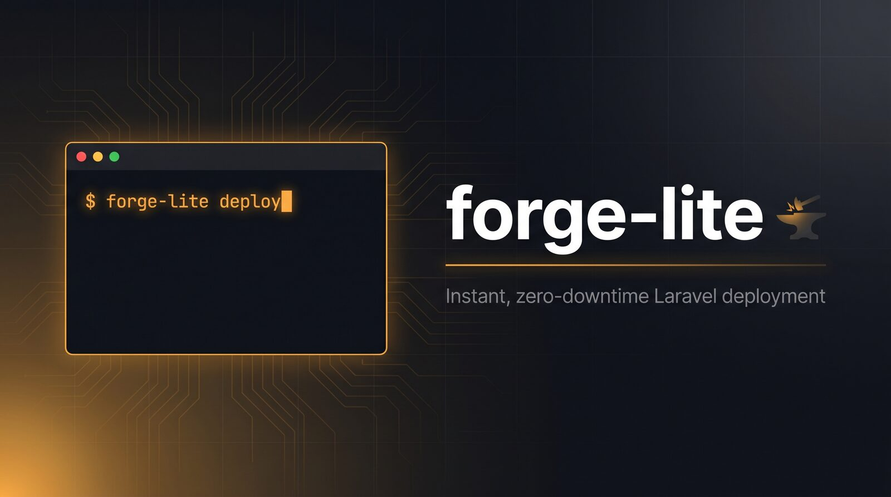

<p align="center">
  
</p>

<p align="center">
  A lightweight, bash-based server provisioning and deployment system for Laravel projects.<br>
  A self-hosted alternative to Laravel Forge, targeting Ubuntu 24.04.
</p>

## Features

- **Full server provisioning**: NGINX, PHP 8.1–8.4, MariaDB, Redis, Node.js, Supervisor, Certbot
- **Site management**: One command to create a fully configured Laravel site (FPM pool, vhost, database, queue workers, scheduler, SSL)
- **Zero-downtime deployments**: Atomic symlink swap with automatic rollback support
- **CI/CD ready**: GitHub Actions workflows for automatic deployment on push
- **Idempotent**: Every script is safe to re-run
- **Basic Auth**: Password-protect any site with a single command — manage users, enable/disable without downtime
- **CLI tools**: Unified `forge-lite` command plus `forge-lite-db`, `forge-lite-ssl`, `forge-lite-env`, `forge-lite-auth`, `php-switch`

## Prerequisites

- Fresh Ubuntu 24.04 server
- Root access (or sudo)
- SSH key-based access configured

## Codex contributor setup

Codex project configuration loads only after the repository is trusted. Review and trust the project hooks with `/hooks`, and repeat this after hook changes. Confirm Context7 is available with `/mcp`.

Existing users should move the stale `.claude` directory outside the repository as a backup, then remove it after verifying the Codex setup. Start a new Codex session after setup changes.

## Quick Start

### Cloud-init (fully automated)

Provision a fresh server without logging in — paste `cloud-init/cloud-config.yml` as **User Data** when creating the server. Edit the configuration variables at the top of the `runcmd` block (repo URL, PHP version, passwords, etc.) before use.

Works with Hetzner Cloud, DigitalOcean, AWS EC2, Vultr, Linode, and any provider that supports cloud-init.

Monitor progress on the server:
```bash
tail -f /var/log/forge-lite-cloud-init.log
```

### 1. Clone to the server

```bash
git clone https://github.com/Padrio/Forge-Lite.git /opt/forge-lite
cd /opt/forge-lite/cli
```

### 2. Provision the server

```bash
sudo ./forge-lite provision
```

Options:
```
--php-default=8.3       Default PHP CLI version
--db-password=PASS      MariaDB root password (auto-generated if omitted)
--redis-password=PASS   Redis password (auto-generated if omitted)
--node-version=22       Node.js major version
--skip-reboot           Don't reboot after provisioning
--force                 Re-provision (ignores existing marker)
```

### 3. Add a site

```bash
sudo forge-lite site add \
  --domain=example.com \
  --php=8.3 \
  --queue-workers=2 \
  --ssl
```

Options:
```
--domain=DOMAIN         Domain name (required)
--php=VERSION           PHP version (default: 8.3)
--queue-workers=N       Queue worker processes (default: 2)
--enable-ssr            Enable Inertia SSR process
--enable-horizon        Use Horizon instead of queue workers
--no-scheduler          Disable Laravel scheduler
--ssl                   Issue SSL certificate
--alias=DOMAIN          Additional server name (repeatable)
--env=KEY=VALUE         Extra .env variable (repeatable)
```

**Manage domain aliases (on existing sites):**
```bash
sudo forge-lite site alias example.com --add=www.example.com
sudo forge-lite ssl issue example.com

sudo forge-lite site alias example.com --add=app.example.com
sudo forge-lite site alias example.com --list
sudo forge-lite site alias example.com --remove=app.example.com
```

The first two commands are the standard alias/SSL workflow. On a site that
already has SSL enabled, `site alias --add` expands and verifies the primary
site's certificate *before* the alias is activated in NGINX; if certificate
issuance fails, the alias change is rolled back. The explicit `ssl issue` call
is therefore idempotent for SSL-enabled sites and enables SSL after adding an
alias to an HTTP-only site.

`forge-lite ssl issue` also accepts a known alias. For example,
`forge-lite ssl issue www.example.com` resolves `www.example.com` to its
primary site, requests the primary domain plus all configured aliases, and
keeps the certificate lineage under `example.com`.

### 4. Deploy

**Configure repo-based deployments (one-time):**
```bash
sudo forge-lite deploy setup example.com \
  --repo=git@github.com:your-org/your-app.git \
  --branch=main
```

**Deploy (uses saved repo config):**
```bash
sudo forge-lite deploy example.com
```

**Manual deployment with explicit repo:**
```bash
sudo forge-lite deploy example.com \
  --repo=git@github.com:your-org/your-app.git \
  --branch=main
```

**Artifact deployment (from CI):**
```bash
sudo forge-lite deploy example.com \
  --artifact=/tmp/deploy-artifact.tar.gz
```

Options:
```
--repo=URL              Git repository URL
--branch=BRANCH         Git branch (default: main)
--artifact=PATH         Deploy from a tar.gz artifact instead of git
--keep=N                Number of releases to keep (default: 5)
```

**Rollback:**
```bash
sudo forge-lite rollback example.com
```

### 5. GitHub Actions (CI/CD)

Deployments use **self-hosted runners** on your server — no SSH secrets needed. Multiple runners can run on the same server (one per repo/environment).

**Set up a runner (per repo):**

1. Go to your GitHub repo → Settings → Actions → Runners → **New self-hosted runner**
2. Copy the registration token
3. On your server:
   ```bash
   sudo forge-lite runner setup \
     --repo=git@github.com:your-org/your-app.git \
     --token=AXXXXXXXXXXXXXXXXXXXXXXXXXXXX \
     --labels=forge-lite,production
   ```
   The runner name is auto-derived from the repo (`your-app`), or set explicitly with `--name=myapp`. Both SSH and HTTPS repo URLs are supported.

4. Verify the runner is online:
   ```bash
   sudo forge-lite runner status
   sudo forge-lite runner list
   ```

**Multiple runners on one server:**
```bash
# Production app
sudo forge-lite runner setup \
  --repo=git@github.com:org/app.git \
  --token=TOKEN1 \
  --name=app-production \
  --labels=forge-lite,production

# Staging app
sudo forge-lite runner setup \
  --repo=git@github.com:org/app.git \
  --token=TOKEN2 \
  --name=app-staging \
  --labels=forge-lite,staging

# Different repo
sudo forge-lite runner setup \
  --repo=git@github.com:org/other-app.git \
  --token=TOKEN3
```

**Remove a runner:**
```bash
sudo forge-lite runner remove --name=app-staging --token=REMOVAL_TOKEN
```

**Configure workflows:**

1. Edit `templates/workflows/deploy-production.yml` — set your domain
2. Edit `templates/workflows/deploy-staging.yml` — set your staging domain
3. Push to `main` (production) or `develop` (staging) to trigger deployment

**Multi-server setup:** Use different labels per server (e.g., `forge-lite,production` vs `forge-lite,staging`) and match them in the workflow files.

## CLI Tools

After provisioning, these are installed to `/usr/local/bin/`:

### php-switch
```bash
sudo php-switch 8.4      # Switch default PHP CLI + FPM
```

### forge-lite-db
```bash
sudo forge-lite-db create myapp       # Create database + user
sudo forge-lite-db list               # List databases
sudo forge-lite-db backup myapp       # Backup to /home/deployer/backups/
sudo forge-lite-db dump example.com --keep=14   # Dump a site's DB, prune old
sudo forge-lite-db restore myapp dump.sql.gz
sudo forge-lite-db drop myapp --yes   # Drop database + user
```

Dumps are written `600 deployer:deployer` into `/home/deployer/backups/` (dir
`700`) and pruned to the newest `--keep=N` per site (default **14**). They hold
personal data — they are never world-readable.

### Offsite backups (optional)

Offsite upload is **dormant by default** — `forge-lite-db` keeps backups local
unless you opt in. To enable it, copy the example config and fill it in:

```bash
sudo cp /etc/forge-lite/backup.conf.example /etc/forge-lite/backup.conf
sudo chmod 600 /etc/forge-lite/backup.conf
sudo nano  /etc/forge-lite/backup.conf       # set BACKUP_S3_ENABLED=true + creds
sudo apt-get install -y rclone               # upload tool (only needed if enabled)
```

`backup.conf` keys: `BACKUP_S3_ENABLED`, `BACKUP_S3_BUCKET`, `BACKUP_S3_PREFIX`,
`BACKUP_S3_ENDPOINT`, `BACKUP_S3_REGION`, `BACKUP_S3_PROVIDER`,
`BACKUP_S3_ACCESS_KEY`, `BACKUP_S3_SECRET_KEY`. Optional client-side encryption
before upload: `BACKUP_ENCRYPT=age|gpg` with `BACKUP_AGE_RECIPIENT` /
`BACKUP_GPG_RECIPIENT`. When enabled, every `dump`/`backup` uploads via rclone
(driven entirely from env — no `rclone.conf`, no creds in the process list); if
`rclone` is missing the command aborts with a clear message rather than silently
skipping. The upload tool is wrapped in `upload_to_s3()` in `forge-lite-db`, so
swapping rclone for `aws-cli`/`s3cmd` is a one-function change.

### forge-lite-ssl
```bash
sudo forge-lite ssl issue example.com        # Obtain or expand the site's certificate
sudo forge-lite ssl issue www.example.com    # Known alias resolves to its primary site
sudo forge-lite-ssl renew example.com    # Force renew
sudo forge-lite-ssl status example.com   # Show certificate info
```

### forge-lite-auth
```bash
sudo forge-lite auth enable example.com                    # Enable with auto-generated admin password
sudo forge-lite auth enable example.com --user=dev         # Custom username
sudo forge-lite auth enable example.com --user=dev --password=secret --realm="Staging"
sudo forge-lite auth add example.com --user=reviewer       # Add another user
sudo forge-lite auth remove example.com --user=reviewer    # Remove a user
sudo forge-lite auth list example.com                      # List all users
sudo forge-lite auth status example.com                    # Show enabled/disabled + user count
sudo forge-lite auth disable example.com                   # Disable (users preserved for re-enable)
```

### forge-lite-env
```bash
sudo forge-lite-env list example.com           # Show all .env variables
sudo forge-lite-env get example.com APP_KEY    # Get a variable
sudo forge-lite-env set example.com KEY VALUE  # Set a variable
sudo forge-lite-env delete example.com KEY     # Remove a variable
sudo forge-lite-env audit                      # Check every site's .env perms
sudo forge-lite-env audit --fix                # Fix any drift (deployer:deployer 600)
```

> **`.env` permissions are `600 deployer:deployer`.** They hold DB, Redis and
> mail secrets. `add-site`, every `forge-lite-env set/delete`, and every deploy
> re-assert these perms automatically. If you ever hit `permission denied`
> editing a `.env`, **never** `chmod 777` it — check the owner instead
> (`sudo chown deployer:deployer …`) or edit via `forge-lite-env set`. Run
> `forge-lite-env audit --fix` to repair drift across all sites at once.

### forge-lite update
```bash
sudo forge-lite update   # Reinstall CLI tools and bash completions
```

### forge-lite runner
```bash
sudo forge-lite runner setup --repo=URL --token=TOKEN [--name=NAME] [--labels=LABELS]
sudo forge-lite runner remove --name=NAME --token=TOKEN
sudo forge-lite runner status
sudo forge-lite runner list
```

## Site Management

**List all sites:**
```bash
sudo forge-lite site list
```

**Remove a site:**
```bash
sudo forge-lite site remove example.com
sudo forge-lite site remove example.com --keep-db --keep-files
```

## Directory Layout

### On the server
```
/home/deployer/sites/<domain>/
├── releases/                  # Timestamped release directories
│   ├── 20240101_120000/
│   └── 20240102_150000/
├── shared/
│   ├── .env                   # Shared environment file
│   └── storage/               # Shared Laravel storage
└── current -> releases/XXX    # Symlink to active release
```

### Configuration
```
/etc/forge-lite/<domain>.conf         # Site configuration (KEY=VALUE)
/etc/forge-lite/auth/<domain>.conf    # Basic Auth nginx directives (empty = disabled)
/etc/forge-lite/auth/<domain>.htpasswd # Basic Auth user credentials
/root/.forge-lite-credentials         # Generated passwords (chmod 600)
```

## What Gets Provisioned

| Component | Details |
|-----------|---------|
| **System** | deployer user, UTC timezone, en_US.UTF-8 locale, open file limits, journald capped (200M) |
| **Swap** | Size based on RAM, sysctl tuning (`vm.swappiness=10`), OOM priorities |
| **Security** | SSH hardening (key-only, `PermitRootLogin prohibit-password`, MaxAuthTries=3), UFW (22/80/443), Fail2Ban, unattended-upgrades |
| **NGINX** | Mainline, DH params, gzip, rate limiting, security headers (HSTS, X-Frame-Options, X-Content-Type-Options, Referrer-Policy, Permissions-Policy — re-asserted on static assets), OCSP stapling, CSP opt-in (Report-Only template) |
| **PHP** | 8.2, 8.3, 8.4 with FPM + Laravel extensions + OPcache/JIT (8.1 is EOL, opt-in via `provision --php-versions=`). Only the **default** version's FPM is started; other versions install stopped+disabled and are enabled on demand when a site uses them. |
| **Composer** | Global install with weekly auto-update |
| **MariaDB** | Secured, InnoDB tuned (buffer pool 20% RAM capped 1024M, full durability `flush_log=1`; override via `--db-buffer-pool=` / `--db-flush-log=`), forge-lite admin user |
| **Redis** | Password-protected, AOF, maxmemory (25% RAM), `volatile-lru` (evicts only TTL keys — protects queue/Horizon jobs) |
| **Node.js** | v22 via NodeSource |
| **Supervisor** | For queue workers, Horizon, SSR |
| **Certbot** | Let's Encrypt with nginx plugin + auto-renewal |
| **GitHub Runner** | Self-hosted Actions runner (optional, via `forge-lite runner setup`) |

## Troubleshooting

**View credentials:**
```bash
sudo cat /root/.forge-lite-credentials
```

**Check site config:**
```bash
cat /etc/forge-lite/example.com.conf
```

**Test NGINX config:**
```bash
sudo nginx -t
```

**View FPM status:**
```bash
sudo systemctl status php8.3-fpm
```

**View queue worker logs:**
```bash
tail -f /home/deployer/sites/example.com/shared/storage/logs/worker.log
```

**Re-provision (safe — idempotent):**
```bash
sudo forge-lite provision --force --skip-reboot
```

## License

MIT
